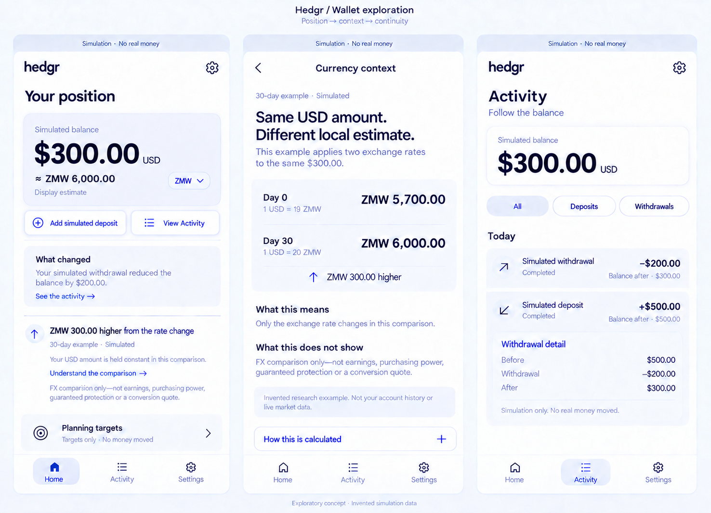

# Wallet redesign — accepted research baseline

Date: 2026-09-15
Ticket: CLASS-A-VAL-002-WALLET-REDESIGN-001
Authority: D-147 / HEDGR_STATUS.md §7 / §7a / §279.
Status: Implemented and locally verified; repository review and hosted checks pending.

## Accepted design

- Home balance: current 20px bordered card, 12% color-100 tint, restrained shadow.
- Deposit / Activity: equal-weight soft white rectangular controls, pale border and current utility shadow; no dark outlines or tinted fill.
- Reading order: position, change observation, currency context, planning targets.
- Currency Context: a focused read-only explanation, keeping constant USD, invented rates and all financial limits explicit.
- Activity: chronological event evidence with a completed event's before/change/after values, filtered without changing reconciliation.
- Research navigation: Home, Activity, Settings. Use the governed logo and existing utility assets rather than generated approximations.

## Translation boundaries

Only the eligible explicit synthetic research journey is redesigned. The image uses invented $300/$500/$200 and ZMW examples; runtime reads existing state and fixtures. Currency Context is a dialog, not a new financial or account-history source. Preserve all exceptional states, non-normal notices, simulation captions, trust disclosures and existing planning meaning even where absent from the image. Default routes, financial state, simulation arithmetic and research distribution remain unchanged.

## Source

Founder accepted the final hybrid in Codex thread 01a0a3d4-b958-7472-afb3-e1e99ba55763 and then explicitly authorized repo translation, research journey first. Imagegen output exec-27470ecb-0e0f-4070-b35d-3c70e5274e8d.png. The ChatGPT conversation Compare Dashboard Variants (6aa904be-c9bc-83ec-90ff-5ab59895c87c) supplied advisory comparison only.

## Verification

- Authority and baseline committed first at `e64f5b58b2cded327eefddfdb4213e1df9f1b568`; deterministic RAP generated from that committed authority.
- Full validate passed: 72 test files / 876 tests, TypeScript, ESLint and repository checks.
- Production build and complete hermetic browser suite passed: 96 tests.
- All five currencies preserve `$0 → +$5 → −$2 → $3`, existing financial storage, transaction rounding and fixed illustrative rates.
- Dialog keyboard containment/Escape/focus return, Activity filters and completed before/after values, 320px/390px/desktop and enlarged text passed.
- Default and unavailable-data routes retain their previous presentation; non-normal posture notices and pending/failed Activity details have direct coverage.
- Matched production captures and comparison history: [design QA](../../../design-qa.md). Local screenshot artifacts are reproducible through `wallet-redesign.spec.ts`.
- Distinct verifier disposition: PASS for the final implementation diff and all three clean production reference captures, with no open P0/P1/P2 findings; final 96-test log and diff check also verified. Hosted checks and preview inspection are separate from these local results.

No dependencies, financial state, engine computations, rate fixtures, Form/protocol or About changes. Technical and visual QA are not participant comprehension, demand or parent acceptance. NO CROSS-LANE IMPACT.
